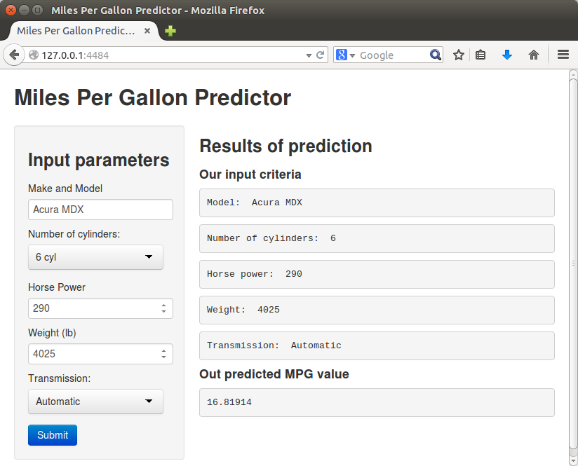

MPG Predictor
========================================================
title: MPG Predictor Application
author: Max G.
date: Oct 25, 2014
font-family: 'Helvetica'

Introduction
========================================================
<large style="width: 100%">
The purpose of the application presented here is to predict miles per gallon (MPG) value
based on other vehicle characteristics using mtcars dataset available in R. 


In the following slides,
we will present the model, methodology and describe how the user can provide inputs to obtain **MPG result**
based on existing data.
</large>

Data & Methodology
========================================================
<small style="font-size: .6em; width: 100%; margin: auto">
For our purposes, we will employ the following methods:
- Use mtcars dataset to establish a fit model
- Use cyl (cylinders), hp (horse power), wt (weight), and am (auto/manual transmission)
- Construct data frame from user provided input
- Implement predict function with the new data using the fit model

Below is a small extract from our dataset:

```r
data(mtcars)
head(mtcars)
```

```
                   mpg cyl disp  hp drat    wt  qsec vs am gear carb
Mazda RX4         21.0   6  160 110 3.90 2.620 16.46  0  1    4    4
Mazda RX4 Wag     21.0   6  160 110 3.90 2.875 17.02  0  1    4    4
Datsun 710        22.8   4  108  93 3.85 2.320 18.61  1  1    4    1
Hornet 4 Drive    21.4   6  258 110 3.08 3.215 19.44  1  0    3    1
Hornet Sportabout 18.7   8  360 175 3.15 3.440 17.02  0  0    3    2
Valiant           18.1   6  225 105 2.76 3.460 20.22  1  0    3    1
```

As an example, we can use Acura MDX as our input data. Specs are available here:
- [Acura Dimensions] (http://www.acura.com/DimensionsCapacities.aspx?model=MDX&modelYear=2015)
- [Acura Engine specs] (http://www.acura.com/Engine.aspx?model=MDX&modelYear=2015)

</small>

User interface
========================================================


***
<small style="font-size: .7em; width: 100%; margin: auto">
A user can test the interface by selecting or entering values in the fields:
- Make and Model (for information only, but can be backed by some reference data)
- Number of cylinders
- Horse power
- Weight (lb)
- Transmission (Auto/Manual)

***
After the form is filled out, user presses "Submit" buttong, and predicted MPG values along with input criteria is displayed on the right side of the screen.

</small>

Function
========================================================
Our function is quite simple actually:
<small style="font-size: .6em; width: 100%; margin: auto">

```r
mpgData <- mtcars
fitModel <- lm(mpg ~ wt + factor(cyl) + factor(am), data=mpgData)

mpgResult <- function(cyl, hp, wt, tr) {
  newdata <- data.frame(cyl=cyl, hp=hp, wt=wt/1000, am=tr)
  predict(fitModel, newdata)

}
```


As can be seen above, we perform the following steps on the server side:
 - construct a fitted model of mpg from the mtcars dataset against three other predictors (weight, cylinder, and transmission type)
 - fire up a predict function with new data supplied by user via the application interface
 
</small>

